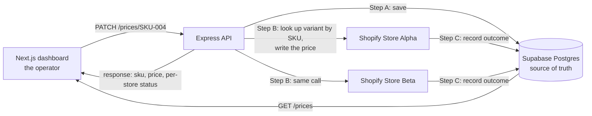

# Task 3 — Centralized Price Sync

## The process, the design, and the problems that had to be fixed

This is a reading document, not a code document. It explains **what the task asked for**, **how the
work was organised**, **how the finished system behaves**, and — in the most detail — **which things
broke on the way and what the fix was**. Everything here was observed in this repository; the
snapshot numbers are dated so they can be re-checked rather than trusted.

Last verified: **2026-09-22**.

---

## 1. The task, restated

Build a small Node.js/Express service that acts as the **single source of truth** for the price of
10 shared SKUs, and propagates any price change to **two Shopify development stores**.

| Requirement | How it is met |
|---|---|
| Two Shopify Partner development stores | Two dev stores in one organisation, each carrying the same 10 products with matching SKUs |
| One central price source for 10 shared SKUs | Supabase Postgres, `products` table, 10 rows, seeded from a checked-in file |
| An API endpoint to update a price | `PATCH /prices/:sku` |
| Push the change to both stores automatically | The same PATCH writes the central price, then the matching variant on both stores, then records the outcome per store |
| **Bonus:** `GET /prices` with per-store live prices and mismatch flags | `GET /prices` returns each SKU with its central price, both stores' price and status read from Shopify on that request, and a `has_mismatch` flag per row |
| **Bonus:** a UI to view, update and watch sync status | Next.js dashboard: 10 rows, a price editor per row, a colour-coded badge per store |

The chain, end to end:

---

## 2. What exists now

- **One deployed URL serves both apps:** the dashboard at `/`, the API at `/health`, `/prices` and
  `/prices/:sku`. This is a single Vercel project declared as two **Services**.
- **One database**, the same Supabase project in every environment — local, and deployed. There is no
  local-only branch in the application code.
- **10 SKUs, 20 sync rows, all healthy.** The price of every SKU matches on both stores, and nothing
  is flagged.
- `task.md` records **57 of 57** tasks done across six phases, each one closed only after its own
  verify step was run.

Snapshot of what the system currently holds (re-read it, do not assume it):

| SKU | Product | Central price |
|---|---|---|
| SKU-001 | Aero Travel Mug | 22.00 |
| SKU-002 | Field Notebook A5 | 30.00 |
| SKU-003 | Merino Crew Socks | 26.50 |
| SKU-004 | Canvas Tote Bag | 31.95 |
| SKU-005 | Ceramic Pour-Over Set | 47.50 |
| SKU-006 | Bamboo Desk Tray | 41.00 |
| SKU-007 | Wool Felt Coasters (4-pack) | 14.00 |
| SKU-008 | Insulated Bottle 750ml | 39.90 |
| SKU-009 | Linen Apron | 54.25 |
| SKU-010 | Brass Desk Lamp | 89.50 |

`store_sync_status` holds **20 rows, every one `synced`** (10 SKUs × 2 stores), and a live check of
the deployed `/prices` returns **10 rows, 0 flagged**.

*(Re-read 2026-09-22: the prices in the table above have moved on — `SKU-001` is `20.00` and
`SKU-009` is `12.00` centrally — and Store A holds `99.51` for `SKU-010` against a central `89.51`,
so the endpoint flags exactly one row. That drift was invisible while the comparison used the last
recorded value, which is why the read was made live.)*

---

## 3. How the work was organised

The task was not attacked as one lump. It was split into a plan, then a task list, then executed one
verifiable step at a time.

**Step 1 — the plan (`plan.md`).** The architecture: the stack, the two stores, the schema, the two
routes, the deployment shape, and the phases.

**Step 2 — the task breakdown (`task.md`).** Every phase was converted into small tasks with a fixed
shape: *why it exists*, *what to do*, *which files it touches*, *what "done" means*, *the exact
verify command*, and *what it blocks*. Nothing bigger than 30 minutes; anything larger was split.

**Step 3 — execution, one task at a time.** Each task followed the same discipline:

1. Re-verify the tasks it depends on are genuinely still green — not just ticked.
2. Do the work.
3. Run the task's own verify step.
4. Write the **observed result** onto the task's evidence line, and update the progress table in the
   same edit.

The rule that made this work: **a task is done when its verify step has been run, not when the code
exists.** That single rule is what turned several silent failures into visible ones.

**The phases and their size:**

| Phase | What it covered | Tasks |
|---|---|---|
| 0 | Environment and store preparation | 14 |
| 1 | Central backend service | 18 |
| 2 | Frontend dashboard | 9 |
| 3 | Deployment | 7 |
| 4 | End-to-end acceptance | 6 |
| 5 | Product images (added later, on request) | 3 |

---

## 4. The design, and why it looks like this

### 4.1 The backend

Four ideas hold the backend together, and each one is a deliberate answer to a failure mode.

**The central price is written first.** The PATCH saves to Postgres before either store is told. If
both stores are down, the price the operator typed is still the recorded price, and the failure is
visible rather than lost. The response is a `502` only when *no* store accepted it.

**Each store is synced in its own error boundary.** One store failing does not roll back the other
and does not fail the request. The store that let the price slip is captured on its own row and in
the response, so the dashboard can say *which* one broke instead of "something went wrong".

**Two different failure words, on purpose.** `failed` means the store could not be read or written at
all, so its price is unknown. `mismatch` means the store *was* read and is holding a different price.
Collapsing these into one word would hide the difference between "I could not ask" and "I asked, and
it disagrees".

**The Shopify token is never stored.** Since admin-created custom apps can no longer be created, the
credential is a Dev Dashboard app exchanging its client id/secret for a **24-hour Admin API token per
store**, cached in memory until shortly before it expires. There is no long-lived shop token in an
environment variable to leak or forget to rotate.

**One catalogue, one list of stores.** The store registry is defined once, so the sync loop and the
failure tests read the same two entries. Adding a third store would be a one-line change.

### 4.2 The data layer

Two tables carry the whole task:

- **`products`** — the central catalogue: SKU, name, price, when it last changed.
- **`store_sync_status`** — one row per store per SKU: the price that store was last seen holding,
  the status, when it was last touched, and the error if there was one.

A third table, `product_images`, was added later for the image work.

**Prices are compared as numbers, never as text.** A PostgreSQL `numeric` column comes back as a
string, and Shopify also returns money as a string, so `"22.0"` and `"22.00"` would read as drift if
they were compared literally. Both places that compare them — `prices.js`, which decides the
dashboard's flags, and `refresh-status.js`, which writes the recorded log — convert explicitly, so a
formatting difference never masquerades as a price change.

### 4.3 The database connection

The app talks to Supabase with **node-postgres over the connection pooler**, using the standard
`PG*` environment names. Those are the same names `psql` reads, so the application, a manual query
and the schema-seeding scripts all share one credential and one connection profile. The pooler is
reached over IPv4, so the identical configuration works from a container and from Vercel.

The pool is created once at module scope with a small maximum, because the pooler runs in session
mode and every held connection occupies a slot for its whole life.

### 4.4 The frontend

A server-rendered page — the first paint already contains the catalogue rather than flashing an empty
table — plus one client component per row for the editor. The row layout is a single CSS grid that
dissolves into labelled lines on a phone and aligned columns on a desktop, so the same markup serves
both without a sideways-scrolling table.

The page is explicitly rendered **per request**, not prerendered at build time. Without that, a
deployed dashboard would serve the prices it saw at build time for ever, and its "refresh" button
would re-fetch the same frozen payload.

### 4.5 The deployment

One Vercel project, two Services, one URL. Top-level routing sends the three API paths to the backend
service and everything else to the frontend. The frontend declares a **binding** to the backend, so
Vercel injects the backend's URL into the frontend's server-side environment — no API hostname is
hard-coded anywhere. The browser itself needs no base URL at all: it calls the API on its own origin.
That is why the same code works locally (where the API is on a different port) with no special case.

---

## 5. The two processes, step by step

### 5.1 What happens when a price is updated

Someone types a new price for `SKU-004` in the dashboard and submits.

1. **Validate before writing anywhere.** The price must be a non-negative decimal with at most two
   decimal places. Anything else — empty, negative, three decimals, scientific notation — is rejected
   with a `400` before the database or either store is touched. The row's input is a number field with
   a step of 0.01, so most bad input cannot even be typed.
2. **Confirm the SKU exists.** An unknown SKU is a `404`, not a silent no-op.
3. **Step A — write the central price.** Postgres stores the value and returns what it actually
   stored, which is what everything downstream reports.
4. **Step B — for each store: find the variant, then write the price.** The store is searched by SKU
   to locate the variant. The lookup also returns the product the variant belongs to, because the
   only remaining variant price-write in this API version addresses the product.
5. **Step C — record the outcome, per store.** Success is `synced` with the price the store now
   holds. A lookup that failed is `failed` with no live price. A write that failed after the lookup
   succeeded is `mismatch` with the price the store was holding.
6. **Answer.** The response carries the SKU, the applied price and one entry per store. It is a `200`
   when at least one store took the price and a `502` when neither did. Either way, the dashboard's
   badges and its inline message are driven by the same response — the operator sees the store that
   failed, with the error text attached to the badge.

### 5.2 What happens when the dashboard is viewed

`GET /prices` reads both stores and returns the catalogue plus each store's **live** state, with each
row flagged when something disagrees. A row is flagged when any store is not `synced`, when any
store's live price differs from the central price, or when no store has reported on that SKU at all —
the last case matters because silence is not agreement.

The read is one Admin API query per store — every variant as `sku → price` — rather than one per SKU,
so a dashboard load costs two Shopify calls; measured warm at roughly `0.6 s` locally. A store that
cannot be read is reported as `failed` on every row with the error attached, and the request is still
a `200`, because the catalogue itself is available. A price changed directly in a Shopify admin is
therefore flagged on the next page load.

A flagged row is also **actionable**. The dashboard renders a *drift resolver* on it — *Store A holds
99.51, central is 89.51* — offering `Keep central` or `Use Store A`. Which of the two prices is right
is a business decision rather than a technical one, so the operator makes it; both options are the
same `PATCH`, so both stores end up holding whichever was chosen. A store whose read failed offers no
"use" option, because there is nothing to adopt.

`node backend/scripts/refresh-status.js` still exists, and still reads each store live, but its job
has narrowed: it keeps the *recorded* log (`store_sync_status` and its `last_synced_at`) level with
the stores instead of making the dashboard correct. It sends no price anywhere, so running it is
always safe.

---

## 6. The problems that had to be fixed

This is the part worth reading. Every one of these was found by running the verify step, not by
reading the code, and several would have been invisible in a local-only build.

### 6.1 The credential the plan assumed can no longer be created

The plan said "create a custom app in the store admin and copy the access token". Shopify has since
discontinued that: admin-created custom apps cannot be created any more, and the instruction is now
to use the Dev Dashboard or the CLI. **Fix:** create the app once in the Dev Dashboard, release a
version declaring the product scopes, install it on both stores, and keep only the app's client id
and secret. The backend exchanges those for a short-lived token **per store** with the client
credentials grant.

Two traps came with it. A successful mint proves nothing on its own — the first attempt returned a
token with an **empty scope list** and every product field answered "access denied", so a usable
credential has to be proved by reading a real field. And granting new scopes to a released app
version does **not** update stores that already installed it; the merchant has to approve the change.

### 6.2 The stores were not empty

Both stores arrived with 17 demo products, so "the store shows 10 items" could never have passed.
**Fix:** delete the demo catalogue through the Admin API and re-seed from the checked-in file, which
makes "10 products" literally true rather than approximately true. The delete was cross-checked
against an independent credential path, so the result was not a script agreeing with itself.

### 6.3 Seeding a single-variant product is rejected

The seeding call refused a product with one variant and no options, complaining that an option value
was null. **Fix:** send an explicit option set with the single "Default Title" value and a matching
option value on the variant. This is the shape a store has to be restored with, so it is written down
rather than rediscovered.

### 6.4 The variant price mutation no longer exists

The price write was rejected — not with a failure status, but with **HTTP 200** carrying an error
explaining that the field does not exist on the mutation type in the pinned API version. A status
code check alone would have sailed straight past it. **Fix:** the only remaining variant price-write
addresses the variant's **product**, so the SKU lookup was changed to return the product id alongside
the variant id, and the write was changed to use it.

The general lesson recorded in the project: **introspect the API's mutation list before designing a
call**, rather than trusting remembered field names, because this API version has already removed two
mutations the documentation still describes.

### 6.5 The database route the plan named was unreachable

The plan said "Supabase client". Supabase's direct database host is **IPv6-only** — it publishes no
IPv4 address at all — and containers and Vercel have no route to it, so that route could never work in
production. This was diagnosed by testing the host from the host machine and from a container and
getting opposite answers.

**Fix:** use the **shared connection pooler**, which is IPv4 on every plan and works from a container,
from the local machine and from Vercel. That made the local engine and the production engine the same
engine, removed the need for a local-only branch, and let one credential serve the app, manual queries
and the schema scripts.

### 6.6 The app could not connect even once the route was right

The database connection failed with a self-signed certificate error while the command-line client
connected to the same database perfectly. Both were reading the same setting; they just interpreted it
differently. The command-line client treats "require" as *encrypt, do not verify the chain*, whereas
the Node driver maps it to *full verification*, which the pooler's chain cannot satisfy.

**Fix:** set the relaxed mode explicitly on the connection pool. The environment variable stays as it
was, because the command-line client rejects the relaxed spelling if it appears there — which would
have broken every `psql` verify step in the task list.

### 6.7 Every deployed route returned 500

The deployment answered `500 FUNCTION_INVOCATION_FAILED` on **every** path, including the dashboard,
because the dashboard's own server-side fetch was failing too. The runtime log named the real cause:
the config module requires `PORT`, the deployment does not set it, and the process exited at startup.

**Fix:** make `PORT` the single optional setting with a sensible default, and leave every other name a
hard startup error. This was chosen over adding `PORT` to the deployment because the deployed entry
never actually listens on a port — fixing the cause, not the symptom. The environment table already
described `PORT` as local-only, so the code was brought back in line with its own documentation.

The diagnostic worth keeping: immutable deployment URLs answer `302` because of deployment
protection, so **status must be checked against the alias**, and the actual error read from the
deployment's logs.

### 6.8 Express was not being found by the host

After that, the deployment answered `500` again, this time saying the module's default export must be
a function or a server. The host's Express support looks for an `app`, `index` or `server` file — and
it checked `app.js` before `server.js`. That file exported the app **by name** and deliberately never
called listen, which satisfies neither shape. **Fix:** add a default export to that one file. The
symptom is worth remembering: it hits *every* route including `/`, so a blanket 500 on a
single-deployment host should send you to the backend's entry point first.

### 6.9 The browser evidence was green and the build would still have failed

A later typecheck found an implicit-any that the browser had rendered happily for days, because the
dev server does not typecheck. The next production build would have failed. **Fix:** the type was
declared once against the real response contract, and a rule was adopted for the repository — after
any frontend edit, run **both** the typecheck and a real build, not just the browser check.

### 6.10 The dashboard would have frozen its prices at build time

The build output showed the page as **static**, even though nothing asked for caching. On the deployed
site that would mean the build-time prices are served for ever, the refresh button re-fetches that
same frozen payload, and the frontend build itself would need a live backend to succeed. **Fix:** the
page is rendered per request. This is invisible in development, where everything is dynamic, so it is
checked by reading the build's route table.

### 6.11 Shopify's media API had also moved

Adding product images hit the same class of problem as the price write: the documented mutation does
not exist any more, and the replacement is the media argument of the product-update mutation, which
refuses to be called by identifier alone. Uploading bytes needs a staged upload, and media processing
is **asynchronous** — the upload succeeds with no image attached, then goes through processing before
it is ready, so success may only be reported after polling.

One further trap: Shopify **re-encodes** images on ingest, so the bytes on the CDN are never identical
to what was uploaded and a checksum comparison reports a false failure. The provenance check that does
work is the original file size plus the dimensions.

### 6.12 Free images are not product photography

The image provider is a keyless Creative Commons index, so relevance is a search problem rather than a
catalogue. "Coasters" returns roller coasters, "notebook" returns laptops, and a plausible title can
hide an engraving or a lens. **Fix:** derive the search term from the product name (dropping brand
adjectives, digits and trailing generic nouns), rank candidates by whole-word matches against the
title and the photographer's tags, prefer the shortest title that actually names the object, and
reject artwork and diagrams outright. Four names had no photograph under any derived term at all and
carry an explicitly curated phrase instead — and a phrase still has to be *mentioned* by the chosen
photo. Every choice was judged by opening the downloaded file, because titles lie.

### 6.13 Tooling traps that cost real time

- The Shopify CLI's store-authorization flow redirects to **loopback inside the container**, which
  can never be reached from a published port. It only works with host networking. It also never
  prints its authorization URL, so a small shim was added to write the URL where a human can read it.
- Containers here have **no IPv6 route** while DNS answers with IPv6 addresses first, so installs
  hang rather than fail. Every image carries an IPv4 preference in its resolver configuration.
- A **dev server started before an environment file existed** will not see it, because public
  variables are inlined at compile time. The process has to be restarted, not just the page reloaded.
- A shell that has ever exported the environment file keeps those values, and the loader will not
  override an already-set variable — so a check can read a stale value and look like a failed edit.

---

## 7. How correctness was proved

The task list demanded evidence, so the same five habits recurred.

1. **A verify step per task, run for real.** Not "the code looks right".
2. **Discriminating probes with a control.** A store that does not exist resolves and answers `404`
   while a real one answers `403` after redirect; a real database reference answers `401` with a JSON
   message while a bogus one fails DNS. A bare status code proves nothing on its own.
3. **Idempotent re-verification.** The whole write path is re-proved by PATCHing a SKU **at the price
   it already has** — the lookup, the write on both stores and the timestamp all move, and no live
   price changes. That is how a test can prove the machinery works without disturbing the demo state.
4. **A second, independent path for the important facts.** The main store has an independent CLI
   session, and store prices are read directly through the Admin API, so a claim is not resting on the
   application agreeing with itself. Where no second path existed, that is written down as a caveat
   rather than smoothed over.
5. **Attribution when a human was involved.** Where an observation could only be made by a person,
   the evidence line says so explicitly instead of presenting it as machine-measured.

The failure half of the acceptance test is exercised the same way: one store is deliberately pointed
at a host that does not exist, the deployment is rebuilt, and a single PATCH is issued from the real
dashboard. The result is one store `synced` and the other `failed` with the HTTP error in the badge,
the row flagged, and the central price **still saved** — which is exactly the behaviour the design
promises. Restoring the configuration and issuing the same PATCH again returns both stores to
`synced`. The whole cycle runs in about three minutes and moves no prices.

---

## 8. Known limitations, stated rather than hidden

- **`PATCH /prices/:sku` has no authentication.** The plan specified none, and adding one unasked was
  judged out of scope. Once deployed, the route is publicly writable. This is recorded as a risk, not
  as an oversight.
- **Store state is written, never read live.** A price changed directly in a Shopify admin is only
  visible after the refresh script runs.
- **The app grants far more scopes than it needs** — the install carries roughly a hundred rather than
  the two the plan names. Narrowing it needs a new app version *and* an approval on each store, so it
  is a manual console step.
- **One currency, no rounding logic.** Every price is a two-decimal value.
- **The hosting shape depends on a beta feature** (a single project declared as multiple services).
  The two-project fallback is documented and the files it needs are still present, so this is a
  preference rather than a lock-in.
- **Images are object-appropriate, not product photography**, and their source is a rate-limited
  keyless index — which is why the bytes are stored once and never re-searched.

---

## 9. Running it

Locally, one command brings up the API and the dashboard with nothing but Docker: the API on one
port, the dashboard on another, and the same Supabase project behind both. Each app also runs
straight from its own folder, which is the faster loop while working on one of them.

The two shops are reached with an app credential held only in the backend environment — locally in an
ignored file, deployed as project settings. Nothing secret is in the repository, and the only names
that are secret are the app's client secret and the database password; both are server-only and must
never appear in a variable that reaches the browser.

Three things are worth doing in order when demonstrating it: open the dashboard and read the ten
rows; change one price and watch the two badges; then run the refresh script, which re-reads both
stores live and prints how many rows it wrote and how many failed. If a price is changed directly in
a Shopify admin, that script is what makes the dashboard's mismatch flag appear — which is the
clearest demonstration that the flag is real.

---

## 10. Revision sheet — the facts worth remembering

- **One URL, both apps:** the dashboard and the API share a deployment; the browser calls the API on
  its own origin, so no API hostname is baked into the frontend.
- **The central price is written first**, then each store, then the outcome per store. `200` if any
  store took it; `502` only if none did.
- **`failed` = could not ask. `mismatch` = asked, and it disagrees.** Different words, different
  causes.
- **The Shopify token is minted, cached for 24 hours, and never stored.**
- **Prices are compared as strings, then as numbers** — deliberately, so formatting is never read as
  drift.
- **`GET /prices` reads the stores; it does not trust the log.** One Admin API query per store, so a
  price changed in a Shopify admin is flagged on the next page load, and a store that cannot be read
  shows as `failed` instead of as its last known state.
- **The database is reached over the IPv4 connection pooler** with the standard `PG*` names; the
  direct host is IPv6-only and unusable from a container.
- **The relaxed TLS mode lives on the connection pool, not in the environment**, because the
  command-line client rejects that value and would break every manual query.
- **`PORT` is the one optional setting**, because the deployed entry never listens.
- **The deployed page is rendered per request**, or it would serve build-time prices for ever.
- **Three API surfaces had moved since the plan was written:** the app credential, the variant price
  mutation, and the product media mutation. All three were found by running the call, not by reading
  the docs — so introspect before designing.
- **A green browser check is not a green build.** Typecheck and build after every frontend edit.
- **The verify step, not the code, is what makes a task done.**
